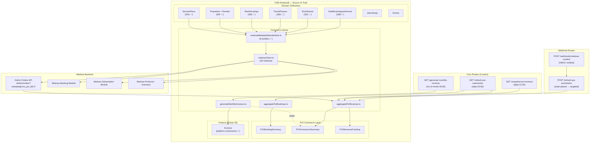

# Dakkah CityOS CMS — Commerce Architecture Map

**Last Updated: 2026-02-20** | **Status: Phase 30G Complete**

---

## Architecture Diagram



---

## Domain → Medusa Mapping (Phase 30 Status)

| CMS Collection           | Domain           | Medusa Operation                      | Phase 30 |
| ------------------------ | ---------------- | ------------------------------------- | -------- |
| `HealthcareAppointments` | healthcare       | `createBooking()`                     | ✅ 30B   |
| `Enrollments`            | education        | `createProduct()`                     | ✅ 30C   |
| `TransitPasses`          | transportation   | `createProduct()` subscription        | ✅ 30D   |
| `MarketListings`         | agriculture      | `createProduct()` inventory           | ✅ 30E   |
| `Properties`             | real-estate      | `createProduct()` / `updateProduct()` | ✅ 30F   |
| `Rentals`                | real-estate      | `createProduct()` / `updateProduct()` | ✅ 30F   |
| `ServicePlans`           | commerce         | `createProduct()` / `updateProduct()` | ✅ 30G   |
| `Services`               | citizen-services | `createProduct()`                     | —        |
| `Events`                 | events-culture   | `createProduct()`                     | —        |

---

## Billing Cycle (Phase 29)

```
POI Commerce Summaries → [monthBounds filter + idempotency guard]
  → generateMonthlyInvoices.ts
    → Per-tenant: sum domain revenues from revenueByDomain
    → Platform fee: grossRevenueSAR × 3.5% (PLATFORM_FEE_RATE)
    → VAT: commissionSAR × 15% (KSA_VAT_RATE)
    → Create Invoice {
        invoiceType: "platform-commission"
        sourceEntity.billingMonth: "YYYY-MM"
        sourceEntity.lineItems: [domain × gross × rate × commission]
        amounts.subtotalSAR, amounts.taxSAR, amounts.totalSAR
      }
→ Cron: 1st of month 00:00 UTC
→ Manual: POST /api/cron/generate-monthly-invoices (ADMIN_API_TOKEN)
```

---

## Canonical Metadata (Phase 30 — All Hooks Done)

All 7 domain collections now inject via `buildMedusaMetadata()`:

| Field            | Value                                     |
| ---------------- | ----------------------------------------- |
| `cms_poi_id`     | `doc.poi?.id \| doc.facility?.id \| null` |
| `cms_domain`     | Domain string (e.g. `"healthcare"`)       |
| `cms_tenant_id`  | `doc.tenant?.id \| doc.tenantId`          |
| `cms_collection` | Slug (e.g. `"healthcare-appointments"`)   |
| `cms_id`         | `doc.id`                                  |
| `cms_title`      | `doc.title \| doc.name`                   |
| `cms_synced_at`  | `new Date().toISOString()`                |

---

## vercel.json — Complete Cron Config

```json
{
  "crons": [
    { "path": "/api/cron/snapshot-poi-revenue", "schedule": "0 1 * * *" },
    { "path": "/api/cron/refresh-poi-summaries", "schedule": "0 2 * * *" },
    { "path": "/api/cron/generate-monthly-invoices", "schedule": "0 0 1 * *" }
  ]
}
```
